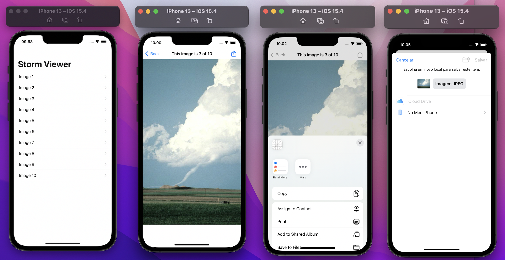

# StormViewer

This week I finished the Storm Viewer project, where user can select a cell and this cell will open a picture. So the user can make some actions, like save, print and more.

## Project

For that, I used UITableViewController.

The numberOfRowsInSection is equal to pictures count.

I used a String Interpolation, to return name of image in cellForRowAt.

DidSelectRowAt was used to open an image when a cell is select. My new viewController loaded the content of had select cell. I add a title and a rightBarButtonItem in navigation. The 

RightBarButtonItem is .action system item, so displays an arrow coming out of a box, signalling the user can do something when it's tapped.

**Learning about: Swift, Xcode, UITableViewController, UIImageView, UIImage, UINavigationBar and more.**

##

*This project was developed during Hacking with Swift course .*
